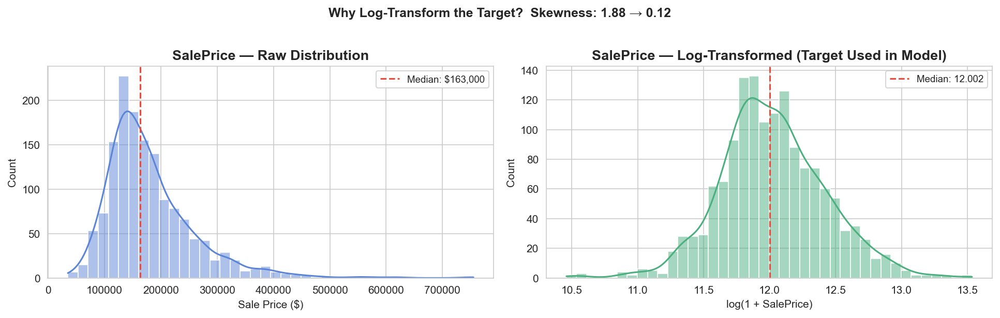
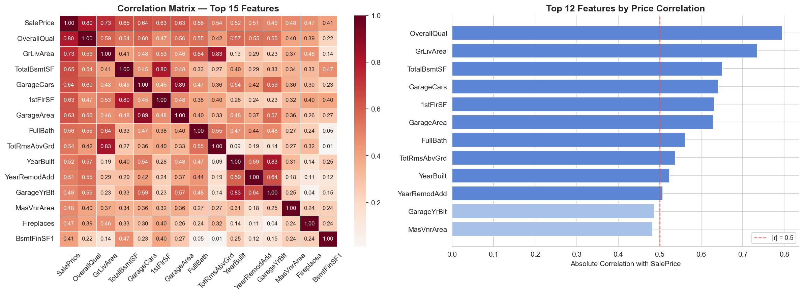

# House Price Prediction ML Pipeline

End-to-end machine learning project focused on predicting residential property sale prices using the Ames Housing dataset from Kaggle. This repository demonstrates a complete regression workflow including data preprocessing, exploratory data analysis, feature engineering, model training, evaluation, hyperparameter tuning, and prediction generation using Scikit-learn pipelines.

---

## Project Overview

This project focuses on predicting residential house sale prices using structured housing data from the Ames Housing dataset. The project was built to strengthen practical machine learning skills through real-world regression modeling and end-to-end ML workflow implementation.

The workflow includes:
- data cleaning
- missing value handling
- exploratory data analysis
- feature engineering
- preprocessing pipelines
- regression modeling
- hyperparameter tuning
- Kaggle submission generation

---

## Problem Statement

Housing prices depend on multiple factors such as:
- neighborhood
- property size
- construction quality
- basement area
- garage capacity
- year built
- overall condition

The objective of this project is to build a regression model capable of accurately predicting `SalePrice` for unseen residential properties using historical housing data.

---

## Dataset

- Dataset: Ames Housing Dataset
- Competition: House Prices — Advanced Regression Techniques
- Source: Kaggle

Competition Link:  
https://www.kaggle.com/competitions/house-prices-advanced-regression-techniques

### Files Used

- `train.csv` — training dataset containing housing features and target variable (`SalePrice`)
- `test.csv` — unseen test dataset used for prediction generation
- `submission.csv` — generated predictions exported in Kaggle submission format

The dataset contains multiple residential property features including:
- neighborhood
- lot area
- number of rooms
- overall quality
- basement information
- garage features
- year built
- sale condition
- and many other structured housing attributes.

---

## Tech Stack

### Programming & Data Analysis
- Python
- Pandas
- NumPy

### Machine Learning
- Scikit-learn
- ElasticNet Regression
- GridSearchCV
- Pipeline API

### Data Visualization
- Matplotlib
- Seaborn

---

## Project Workflow

### 1. Data Loading
- Imported training and testing datasets
- Inspected feature types and target variable distribution

### 2. Data Cleaning
- Handled missing values
- Removed unnecessary features
- Processed numerical and categorical columns separately

### 3. Exploratory Data Analysis (EDA)
- Analyzed correlations between features and target variable
- Visualized data distributions
- Identified skewness and potential outliers

### 4. Feature Engineering
- Built preprocessing pipelines
- Applied transformations to improve model performance
- Encoded categorical variables
- Reduced risk of data leakage using Scikit-learn pipelines

### 5. Model Training
- Implemented ElasticNet Regression model
- Performed hyperparameter tuning using `GridSearchCV`
- Evaluated model performance using cross-validation

### 6. Prediction Generation
- Generated predictions on unseen test dataset
- Exported results in Kaggle submission format

---

## Model Used

### ElasticNet Regression

The final model uses `ElasticNet`, a regularized linear regression algorithm that combines:
- L1 Regularization (Lasso)
- L2 Regularization (Ridge)

This approach helps:
- reduce overfitting
- improve model generalization
- handle multicollinearity effectively

A Scikit-learn preprocessing pipeline was implemented for:
- numerical feature transformation
- categorical encoding
- missing value handling
- model training and evaluation

Hyperparameter tuning was performed using `GridSearchCV` to optimize model performance.

---

## Kaggle Performance

| Metric | Score |
|---|---|
| Public RMSE Score | 0.12078 |

---

## Results

- Successfully built and evaluated a regression pipeline for house price prediction
- Generated prediction outputs for unseen housing data
- Achieved Kaggle Public RMSE Score of **0.12078**
- Built reusable preprocessing and modeling pipelines using Scikit-learn

This project helped strengthen understanding of:
- regression workflows
- preprocessing pipelines
- feature engineering
- regularization techniques
- practical machine learning implementation

Notebook:
```text
notebooks/house_price_prediction_pipeline.ipynb
```

---

## Repository Structure

```text
house-price-prediction-ml/
│
├── data/
│   ├── train.csv
│   ├── test.csv
│   └── submission.csv
│
├── notebooks/
│   └── house_price_prediction_pipeline.ipynb
│
├── outputs/
│   ├── saleprice_distribution.png
│   ├── top_feature_correlation.png
│   └── submission.csv
│
├── README.md
├── requirements.txt
├── .gitignore
└── LICENSE
```

---

## Visualizations

### Sale Price Distribution



### Top Feature Correlation



---

## Skills Demonstrated

- Data Cleaning
- Exploratory Data Analysis
- Feature Engineering
- Machine Learning Pipelines
- Regression Modeling
- Hyperparameter Tuning
- Cross Validation
- Predictive Analytics
- Kaggle Workflow
- Model Evaluation

---

## Future Improvements

Planned improvements for future iterations:

- Compare Ridge and Lasso Regression models
- Experiment with Random Forest and XGBoost
- Apply advanced feature engineering techniques
- Add SHAP-based model explainability
- Deploy an interactive prediction app using Streamlit
- Improve model performance using ensemble methods

---

## Installation

Clone the repository:

```bash
git clone https://github.com/D1VYANSHx7877/house-price-prediction-ml.git
```

Navigate to the project folder:

```bash
cd house-price-prediction-ml
```

Install dependencies:

```bash
pip install -r requirements.txt
```

Run the notebook:

```bash
jupyter notebook
```

---

## Author

Divyansh Dhadhich

Aspiring Data Scientist & Machine Learning Engineer focused on building practical AI and ML solutions using Python, SQL, Machine Learning, Deep Learning, and future Generative AI technologies.
